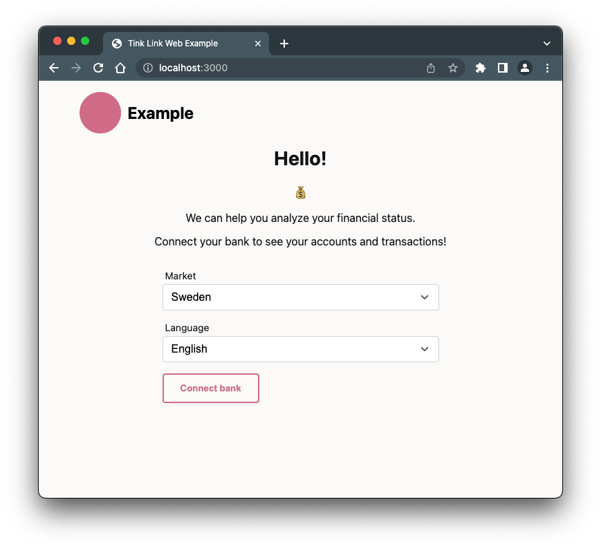

# Tink Example

This is an example web app that demonstrates how you can integrate the Tink API to fetch accounts and transaction data.

## Installation

Install the LTS (v18+) or newer version of [Nodejs](https://nodejs.org/en).

### Prerequisites

1. Create your developer account at [Tink Console](https://console.tink.com)
2. Follow the [getting started guide](https://docs.tink.com/resources/getting-started/set-up-your-account) to retrieve your `client_id` and `client_secret`
3. Register the redirect URI for the example app (`http://localhost:3000/callback`) in the [list of redirect URIs under your app's settings](https://console.tink.com/app-settings/client)

## Running locally


1. Set environment variables

Update the "start" script in `package.json` to include your client id and client secret

```diff
diff --git a/package.json b/package.json
--- a/package.json
+++ b/package.json
@@ -4,7 +4,7 @@
   "description": "",
   "main": "server.js",
   "scripts": {
-    "start": "TINK_CLIENT_SECRET= TINK_CLIENT_ID= node server.mjs"
+    "start": "TINK_CLIENT_SECRET=c37cc3c09ab947f5a6fcab********** TINK_CLIENT_ID=de18d62c4d1643c0b3fcea********** node server.mjs"
   },
   "author": "",
   "license": "ISC",
```

2. Set `client_id` in `index.html`

Replace `<TINK_CLIENT_ID>` with your client id in the `value` of the input `name="client_id"`

```diff
--- a/index.html
+++ b/index.html
@@ -40,7 +40,7 @@
           </select>
         </div>
 
-        <input type="hidden" name="client_id" value="<TINK_CLIENT_ID>" />
+        <input type="hidden" name="client_id" value="de18d62c4d1643c0b3fcea**********" />
         <input type="hidden" name="redirect_uri" value="http://localhost:3000/callback" />
 
         <button class="btn">Go!</button>
```

3. Run the local server

```bash
npm start
```

Open [http://localhost:3000](http://localhost:3000) in your browser.

---

## Resources

- Visit the [Tink Console](https://console.tink.com) to create an account
- Explore the [docs](https://docs.tink.com/) for tutorials and product docs
- Check out the [API documentation](https://docs.tink.com/api)
