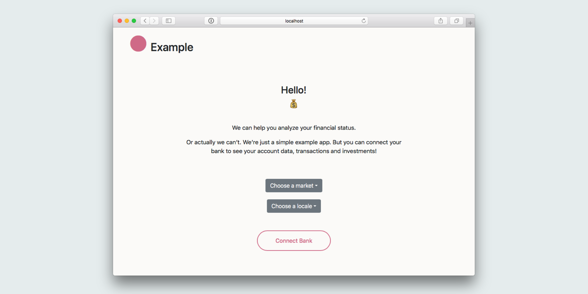

# Tink Connect Example

This is an example web app that demonstrates how you can integrate the Tink API to fetch users' account and transaction data.

This app was bootstrapped with [create-react-app](https://github.com/facebook/create-react-app). Other than that, it has been made as simple as possible.

## Installation

The application requires a Tink API developer account.

### Prerequisites

1. Create your developer account at [Tink Console](https://console.tink.com)
2. Follow the [getting started guide](https://docs.tink.com/resources/getting-started/set-up-your-account) to retrieve your `client_id` and `client_secret`
3. Register the redirect URI for the example app (`http://localhost:3000/callback`) in the [list of redirect URIs under your app's settings](https://console.tink.com/overview)

### Structure

- **Node server/backend**: can be found in `server.js`
- **React client/frontend**: can be found in the `client` folder.

## Running the app locally

1. Install the dependencies.

```
$ npm install
```

2. Set your client identifier and client secret into the following environment variables

```
$ export REACT_APP_CLIENT_ID="<YOUR_CLIENT_ID>"
$ export TINK_CLIENT_SECRET="<YOUR_CLIENT_SECRET>"
```

3. Run both the backend (`server.js`) and the frontend (`client` folder) concurrently:

```
$ npm run dev
```

You should be redirected to the client app on `http://localhost:3000/`. The client runs on port `3000` and the server runs on `8080`.

## Resources

- Visit the [Tink Console](https://console.tink.com) to create an account
- Read our [getting started guide](https://docs.tink.com/resources/getting-started)
- Explore our [resources](https://docs.tink.com/resources/) for tutorials, libraries and demo apps
- Check out the [Tink API documentation](https://docs.tink.com/api)

## Support

👋 We are continuously working on improving the developer experience of our API offering. [Contact us](https://tinkab.atlassian.net/servicedesk/customer/portal/5) for support, questions or suggestions.
